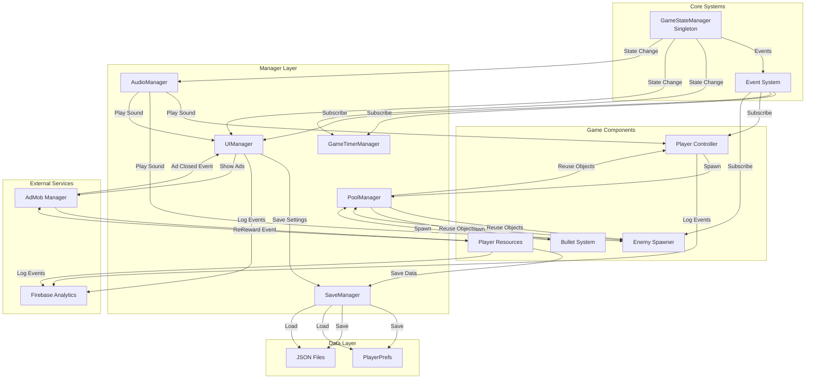
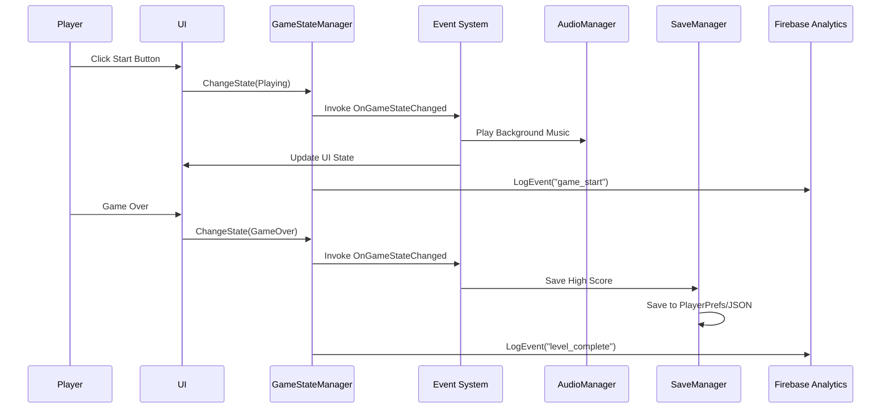

# Tài Liệu Hệ Thống Game - Unity

Tài liệu này tổng hợp các kiến thức về các hệ thống quan trọng trong phát triển game Unity.

---

## 📋 Mục Lục

0. [Sơ Đồ Architecture](#0-sơ-đồ-architecture-kiến-trúc-hệ-thống)
1. [Singleton Pattern](#1-singleton-pattern-mẫu-singleton)
2. [Manager Systems](#2-manager-systems-hệ-thống-quản-lý)
3. [Event System](#3-event-system-hệ-thống-sự-kiện)
4. [Save/Load System](#4-saveload-system-hệ-thống-lưutải)
5. [Object Pooling](#5-object-pooling-nhóm-đối-tượng)
6. [Audio System](#6-audio-system-hệ-thống-âm-thanh)
7. [Firebase Analytics](#7-firebase-analytics-phân-tích-firebase)
8. [AdMob (Quảng cáo)](#8-admob-quảng-cáo)

---

## 0. Sơ Đồ Architecture (Kiến Trúc Hệ Thống)

Sơ đồ dưới đây mô tả mối quan hệ và luồng giao tiếp giữa các hệ thống trong game:

### Sơ Đồ Tổng Quan



### Sơ Đồ Luồng Dữ Liệu



### Mô Tả Kiến Trúc

#### 1. **Lớp Core (Lõi)**
- **GameStateManager**: Quản lý trạng thái game toàn cục, là trung tâm điều phối
- **Event System**: Hệ thống sự kiện cho phép các component giao tiếp mà không phụ thuộc trực tiếp

#### 2. **Lớp Manager (Quản Lý)**
- Các Manager sử dụng **Singleton Pattern** để truy cập global
- Giao tiếp với nhau thông qua **Event System** để giảm coupling
- Mỗi Manager có trách nhiệm riêng biệt (Single Responsibility)

#### 3. **Lớp Game Components (Thành Phần Game)**
- Player, Enemy, Bullet, v.v. sử dụng **Object Pooling** để tối ưu hiệu năng
- Lắng nghe events từ Event System để phản ứng với thay đổi game state
- Gọi trực tiếp các Manager khi cần (AudioManager, PoolManager)

#### 4. **Lớp Data (Dữ Liệu)**
- **SaveManager** quản lý việc lưu/tải dữ liệu
- Sử dụng **PlayerPrefs** cho dữ liệu đơn giản (settings, high score)
- Sử dụng **JSON Files** cho dữ liệu phức tạp (inventory, progress)

#### 5. **Lớp External Services (Dịch Vụ Bên Ngoài)**
- **Firebase Analytics**: Log events từ các hệ thống khác
- **AdMob Manager**: Hiển thị quảng cáo, phát events khi có reward

### Nguyên Tắc Thiết Kế

1. **Singleton Pattern**: Tất cả Manager sử dụng Singleton để truy cập global
2. **Event-Driven**: Giao tiếp chủ yếu qua Event System để giảm coupling
3. **Separation of Concerns**: Mỗi Manager chỉ quản lý một phần cụ thể
4. **Dependency Injection**: Các component phụ thuộc vào interface/abstraction, không phụ thuộc trực tiếp
5. **Performance Optimization**: Sử dụng Object Pooling cho objects spawn thường xuyên

### Luồng Khởi Tạo (Initialization Flow)

```
1. GameStateManager.Awake() → Singleton Setup
2. Event System Setup
3. Các Manager khác khởi tạo (AudioManager, SaveManager, PoolManager...)
4. Load saved data từ SaveManager
5. Initialize External Services (Firebase, AdMob)
6. GameStateManager.ChangeState(Menu)
7. UI hiển thị menu
```

### Ví Dụ Tương Tác Thực Tế

**Khi người chơi bắt đầu level:**

```
Player Click "Start" 
  → UIManager.OnStartButtonClick()
  → GameStateManager.ChangeState(Playing)
  → GameStateManager phát event OnGameStateChanged
  → GameTimerManager lắng nghe event → Bắt đầu đếm thời gian
  → AudioManager lắng nghe event → Phát nhạc nền
  → EnemySpawner lắng nghe event → Bắt đầu spawn enemy
  → FirebaseAnalytics.LogEvent("level_start")
```

**Khi enemy bị tiêu diệt:**

```
Enemy.OnDeath()
  → ObjectPool.ReturnToPool("Enemy", enemy)
  → AudioManager.Play("EnemyDeath")
  → PlayerResources.AddScore(points)
  → FirebaseAnalytics.LogEvent("enemy_killed")
```

---

## 1. Singleton Pattern (Mẫu Singleton)

Singleton Pattern đảm bảo chỉ có một instance duy nhất của class trong toàn bộ ứng dụng.

### Cách triển khai trong Unity:

```csharp
public class GameStateManager : MonoBehaviour
{
    public static GameStateManager Instance;

    void Awake()
    {
        if (Instance == null)
        {
            Instance = this;
            DontDestroyOnLoad(gameObject); // Giữ object qua các scene
        }
        else
        {
            Destroy(gameObject); // Xóa duplicate
        }
    }
}
```

### Ưu điểm:
- ✅ Truy cập global dễ dàng: `GameStateManager.Instance.ChangeState(...)`
- ✅ Đảm bảo chỉ có một instance
- ✅ Dễ quản lý state toàn cục

### Nhược điểm:
- ❌ Khó test
- ❌ Có thể tạo dependency chặt
- ❌ Cần cẩn thận với thread safety

### Ví dụ trong project:

```12:22:Assets/Scripts/GameManager/GameStateManager.cs
    void Awake()
    {
        if (Instance == null)
        {
            Instance = this;
            DontDestroyOnLoad(gameObject);
        }
        else
        {
            Destroy(gameObject);
        }
    }
```

---

## 2. Manager Systems (Hệ thống Quản lý)

Manager Systems là các class tập trung hóa logic quản lý một phần cụ thể của game.

### Các loại Manager phổ biến:

- **GameStateManager**: Quản lý trạng thái game (Playing, Paused, GameOver...)
- **GameTimerManager**: Quản lý thời gian game
- **AudioManager**: Quản lý âm thanh
- **SaveManager**: Quản lý lưu/tải dữ liệu
- **PoolManager**: Quản lý object pooling
- **UIManager**: Quản lý giao diện người dùng

### Best Practices:

1. **Mỗi Manager có trách nhiệm rõ ràng** - Single Responsibility Principle
2. **Sử dụng Singleton khi cần truy cập global**
3. **Sử dụng Events để giao tiếp giữa các Manager** - Giảm coupling
4. **Khởi tạo Manager trong thứ tự đúng** - Sử dụng Script Execution Order

### Ví dụ trong project:

```4:9:Assets/Scripts/GameManager/GameStateManager.cs
public class GameStateManager : MonoBehaviour
{
    public static GameStateManager Instance;

    public GameState CurrentState { get; private set; }
    public event Action<GameState> OnGameStateChanged;
```

---

## 3. Event System (Hệ thống Sự kiện)

Event System giúp các component giao tiếp với nhau mà không cần phụ thuộc trực tiếp vào nhau (loose coupling).

### Cách triển khai cơ bản:

```csharp
// Định nghĩa event
public event Action<GameState> OnGameStateChanged;

// Phát event
OnGameStateChanged?.Invoke(newState);

// Đăng ký lắng nghe
GameStateManager.Instance.OnGameStateChanged += OnGameStateChanged;

// Hủy đăng ký (QUAN TRỌNG!)
GameStateManager.Instance.OnGameStateChanged -= OnGameStateChanged;
```

### Ví dụ trong project:

```9:9:Assets/Scripts/GameManager/GameStateManager.cs
    public event Action<GameState> OnGameStateChanged;
```

```36:37:Assets/Scripts/GameManager/GameStateManager.cs
        HandleState(newState);
        OnGameStateChanged?.Invoke(newState);
```

```44:47:Assets/Scripts/GameManager/GameTimerManager.cs
        if (GameStateManager.Instance != null)
        {
            GameStateManager.Instance.OnGameStateChanged += OnGameStateChanged;
        }
```

### Lưu ý quan trọng:

- ⚠️ **Luôn hủy đăng ký trong `OnDestroy()`** để tránh memory leak
- ⚠️ **Sử dụng `?.Invoke()`** để tránh null reference exception
- ⚠️ **Có thể sử dụng UnityEvent** cho Inspector integration

### Event System nâng cao (Custom Event Manager):

```csharp
public class EventManager : MonoBehaviour
{
    public static EventManager Instance;
    
    private Dictionary<string, Action<object>> events = new Dictionary<string, Action<object>>();
    
    void Awake()
    {
        if (Instance == null)
        {
            Instance = this;
            DontDestroyOnLoad(gameObject);
        }
        else
        {
            Destroy(gameObject);
        }
    }
    
    public void Subscribe(string eventName, Action<object> callback)
    {
        if (!events.ContainsKey(eventName))
            events[eventName] = null;
        events[eventName] += callback;
    }
    
    public void Unsubscribe(string eventName, Action<object> callback)
    {
        if (events.ContainsKey(eventName))
            events[eventName] -= callback;
    }
    
    public void Publish(string eventName, object data = null)
    {
        if (events.ContainsKey(eventName))
            events[eventName]?.Invoke(data);
    }
}
```

---

## 4. Save/Load System (Hệ thống Lưu/Tải)

### A. PlayerPrefs (Đơn giản, dữ liệu nhỏ)

PlayerPrefs phù hợp cho việc lưu settings, high score, và các dữ liệu đơn giản.

```csharp
public class SaveManager : MonoBehaviour
{
    public static SaveManager Instance;
    
    void Awake()
    {
        if (Instance == null)
        {
            Instance = this;
            DontDestroyOnLoad(gameObject);
        }
        else
        {
            Destroy(gameObject);
        }
    }
    
    // Lưu dữ liệu
    public void SaveInt(string key, int value)
    {
        PlayerPrefs.SetInt(key, value);
        PlayerPrefs.Save();
    }
    
    public void SaveFloat(string key, float value)
    {
        PlayerPrefs.SetFloat(key, value);
        PlayerPrefs.Save();
    }
    
    public void SaveString(string key, string value)
    {
        PlayerPrefs.SetString(key, value);
        PlayerPrefs.Save();
    }
    
    // Tải dữ liệu
    public int LoadInt(string key, int defaultValue = 0)
    {
        return PlayerPrefs.GetInt(key, defaultValue);
    }
    
    public float LoadFloat(string key, float defaultValue = 0f)
    {
        return PlayerPrefs.GetFloat(key, defaultValue);
    }
    
    public string LoadString(string key, string defaultValue = "")
    {
        return PlayerPrefs.GetString(key, defaultValue);
    }
    
    // Xóa dữ liệu
    public void DeleteKey(string key)
    {
        PlayerPrefs.DeleteKey(key);
    }
    
    public void DeleteAll()
    {
        PlayerPrefs.DeleteAll();
    }
}
```

### B. JSON Save (Phức tạp hơn, linh hoạt)

JSON Save phù hợp cho việc lưu game data phức tạp, inventory, progress, v.v.

```csharp
using UnityEngine;
using System.IO;
using System;

[Serializable]
public class GameData
{
    public int highScore;
    public int level;
    public float volume;
    public bool soundEnabled;
    public string playerName;
    public List<ItemData> inventory;
}

public class SaveManager : MonoBehaviour
{
    public static SaveManager Instance;
    private string savePath;
    
    void Awake()
    {
        if (Instance == null)
        {
            Instance = this;
            DontDestroyOnLoad(gameObject);
        }
        else
        {
            Destroy(gameObject);
        }
        
        // Đường dẫn lưu file
        savePath = Application.persistentDataPath + "/savegame.json";
    }
    
    // Lưu dữ liệu
    public void SaveGame(GameData data)
    {
        try
        {
            string json = JsonUtility.ToJson(data, true);
            File.WriteAllText(savePath, json);
            Debug.Log("Game saved successfully!");
        }
        catch (Exception e)
        {
            Debug.LogError($"Error saving game: {e.Message}");
        }
    }
    
    // Tải dữ liệu
    public GameData LoadGame()
    {
        try
        {
            if (File.Exists(savePath))
            {
                string json = File.ReadAllText(savePath);
                GameData data = JsonUtility.FromJson<GameData>(json);
                Debug.Log("Game loaded successfully!");
                return data;
            }
            else
            {
                Debug.Log("No save file found. Creating new game data.");
                return new GameData(); // Trả về dữ liệu mặc định
            }
        }
        catch (Exception e)
        {
            Debug.LogError($"Error loading game: {e.Message}");
            return new GameData();
        }
    }
    
    // Kiểm tra file save có tồn tại không
    public bool HasSaveFile()
    {
        return File.Exists(savePath);
    }
    
    // Xóa file save
    public void DeleteSave()
    {
        if (File.Exists(savePath))
        {
            File.Delete(savePath);
            Debug.Log("Save file deleted!");
        }
    }
}
```

### So sánh PlayerPrefs vs JSON:

| Đặc điểm | PlayerPrefs | JSON Save |
|----------|-------------|-----------|
| **Độ phức tạp** | Đơn giản | Phức tạp hơn |
| **Loại dữ liệu** | Chỉ int, float, string | Bất kỳ object nào |
| **Hiệu năng** | Nhanh | Chậm hơn một chút |
| **Bảo mật** | Dễ chỉnh sửa | Dễ chỉnh sửa (có thể mã hóa) |
| **Kích thước** | Giới hạn (~1MB) | Không giới hạn |
| **Sử dụng** | Settings, high score | Game data phức tạp |

### Lưu ý:

- 📁 `Application.persistentDataPath` là đường dẫn an toàn để lưu file trên mọi platform
- 🔒 Có thể mã hóa JSON để tăng bảo mật
- 💾 Nên lưu tự động định kỳ hoặc khi có thay đổi quan trọng

---

## 5. Object Pooling (Nhóm Đối tượng)

Object Pooling là kỹ thuật tái sử dụng object thay vì tạo mới và xóa liên tục, giúp giảm Garbage Collection và tăng hiệu năng.

### Tại sao cần Object Pooling?

- ❌ **Vấn đề**: `Instantiate()` và `Destroy()` tạo ra Garbage Collection, gây lag
- ✅ **Giải pháp**: Tái sử dụng object đã tạo, chỉ activate/deactivate

### Triển khai cơ bản:

```csharp
using UnityEngine;
using System.Collections.Generic;

public class ObjectPool : MonoBehaviour
{
    [System.Serializable]
    public class Pool
    {
        public string tag;
        public GameObject prefab;
        public int size;
    }
    
    public static ObjectPool Instance;
    public List<Pool> pools;
    private Dictionary<string, Queue<GameObject>> poolDictionary;
    
    void Awake()
    {
        if (Instance == null)
        {
            Instance = this;
        }
        else
        {
            Destroy(gameObject);
        }
    }
    
    void Start()
    {
        poolDictionary = new Dictionary<string, Queue<GameObject>>();
        
        // Khởi tạo các pool
        foreach (Pool pool in pools)
        {
            Queue<GameObject> objectPool = new Queue<GameObject>();
            
            for (int i = 0; i < pool.size; i++)
            {
                GameObject obj = Instantiate(pool.prefab);
                obj.SetActive(false);
                objectPool.Enqueue(obj);
            }
            
            poolDictionary.Add(pool.tag, objectPool);
        }
    }
    
    // Lấy object từ pool
    public GameObject SpawnFromPool(string tag, Vector3 position, Quaternion rotation)
    {
        if (!poolDictionary.ContainsKey(tag))
        {
            Debug.LogWarning($"Pool with tag {tag} doesn't exist!");
            return null;
        }
        
        GameObject objectToSpawn = poolDictionary[tag].Dequeue();
        
        objectToSpawn.SetActive(true);
        objectToSpawn.transform.position = position;
        objectToSpawn.transform.rotation = rotation;
        
        // Gọi method OnObjectSpawn nếu có
        IPooledObject pooledObj = objectToSpawn.GetComponent<IPooledObject>();
        pooledObj?.OnObjectSpawn();
        
        poolDictionary[tag].Enqueue(objectToSpawn);
        
        return objectToSpawn;
    }
    
    // Trả object về pool
    public void ReturnToPool(string tag, GameObject obj)
    {
        obj.SetActive(false);
        // Object sẽ được tự động enqueue lại khi spawn
    }
}

// Interface cho object trong pool
public interface IPooledObject
{
    void OnObjectSpawn();
}
```

### Sử dụng:

```csharp
// Spawn bullet
GameObject bullet = ObjectPool.Instance.SpawnFromPool("Bullet", transform.position, transform.rotation);

// Trả về pool khi không dùng (thường trong OnDisable hoặc khi object "chết")
ObjectPool.Instance.ReturnToPool("Bullet", bullet);
```

### Ưu điểm:

- ✅ Giảm Garbage Collection (GC)
- ✅ Tăng hiệu năng đáng kể
- ✅ Kiểm soát số lượng object
- ✅ Tái sử dụng object hiệu quả

### Khi nào nên dùng:

- Bullet, projectile
- Enemy spawn
- Particle effects
- UI elements xuất hiện thường xuyên

---

## 6. Audio System (Hệ thống Âm thanh)

Audio System quản lý tất cả âm thanh trong game một cách tập trung.

### Triển khai:

```csharp
using UnityEngine;
using System.Collections.Generic;

[System.Serializable]
public class Sound
{
    public string name;
    public AudioClip clip;
    [Range(0f, 1f)]
    public float volume = 1f;
    [Range(0.1f, 3f)]
    public float pitch = 1f;
    public bool loop = false;
    public bool playOnAwake = false;
    
    [HideInInspector]
    public AudioSource source;
}

public class AudioManager : MonoBehaviour
{
    public static AudioManager Instance;
    
    [Header("Audio Settings")]
    public Sound[] sounds;
    public float masterVolume = 1f;
    public bool muteAll = false;
    
    private Dictionary<string, Sound> soundDictionary;
    
    void Awake()
    {
        if (Instance == null)
        {
            Instance = this;
            DontDestroyOnLoad(gameObject);
        }
        else
        {
            Destroy(gameObject);
            return;
        }
        
        soundDictionary = new Dictionary<string, Sound>();
        
        // Khởi tạo AudioSource cho mỗi sound
        foreach (Sound s in sounds)
        {
            s.source = gameObject.AddComponent<AudioSource>();
            s.source.clip = s.clip;
            s.source.volume = s.volume * masterVolume;
            s.source.pitch = s.pitch;
            s.source.loop = s.loop;
            s.source.playOnAwake = s.playOnAwake;
            
            soundDictionary[s.name] = s;
        }
    }
    
    // Phát âm thanh
    public void Play(string soundName)
    {
        if (muteAll) return;
        
        if (soundDictionary.ContainsKey(soundName))
        {
            soundDictionary[soundName].source.Play();
        }
        else
        {
            Debug.LogWarning($"Sound: {soundName} not found!");
        }
    }
    
    // Dừng âm thanh
    public void Stop(string soundName)
    {
        if (soundDictionary.ContainsKey(soundName))
        {
            soundDictionary[soundName].source.Stop();
        }
    }
    
    // Tạm dừng
    public void Pause(string soundName)
    {
        if (soundDictionary.ContainsKey(soundName))
        {
            soundDictionary[soundName].source.Pause();
        }
    }
    
    // Tiếp tục
    public void Unpause(string soundName)
    {
        if (soundDictionary.ContainsKey(soundName))
        {
            soundDictionary[soundName].source.UnPause();
        }
    }
    
    // Điều chỉnh volume
    public void SetVolume(string soundName, float volume)
    {
        if (soundDictionary.ContainsKey(soundName))
        {
            soundDictionary[soundName].volume = Mathf.Clamp01(volume);
            soundDictionary[soundName].source.volume = soundDictionary[soundName].volume * masterVolume;
        }
    }
    
    // Điều chỉnh master volume
    public void SetMasterVolume(float volume)
    {
        masterVolume = Mathf.Clamp01(volume);
        
        foreach (Sound s in sounds)
        {
            s.source.volume = s.volume * masterVolume;
        }
    }
    
    // Tắt/bật tất cả
    public void SetMuteAll(bool mute)
    {
        muteAll = mute;
        
        foreach (Sound s in sounds)
        {
            s.source.mute = mute;
        }
    }
    
    // Kiểm tra đang phát
    public bool IsPlaying(string soundName)
    {
        if (soundDictionary.ContainsKey(soundName))
        {
            return soundDictionary[soundName].source.isPlaying;
        }
        return false;
    }
}
```

### Sử dụng:

```csharp
// Phát âm thanh
AudioManager.Instance.Play("Jump");
AudioManager.Instance.Play("BackgroundMusic");

// Điều chỉnh volume
AudioManager.Instance.SetMasterVolume(0.5f);
AudioManager.Instance.SetVolume("BackgroundMusic", 0.3f);

// Dừng âm thanh
AudioManager.Instance.Stop("BackgroundMusic");
```

### Best Practices:

- 🎵 Phân biệt Sound Effects và Music (có thể tách thành 2 AudioSource riêng)
- 🔊 Lưu volume settings vào PlayerPrefs
- 🎚️ Sử dụng AudioMixer để điều chỉnh volume groups
- 📊 Fade in/out cho background music

---

## 7. Firebase Analytics (Phân tích Firebase)

Firebase Analytics giúp theo dõi hành vi người chơi và hiệu năng game.

### Setup:

1. Thêm Firebase SDK vào Unity
2. Tải file `google-services.json` (Android) hoặc `GoogleService-Info.plist` (iOS)
3. Import Firebase Analytics package

### Triển khai:

```csharp
using UnityEngine;
using Firebase;
using Firebase.Analytics;

public class FirebaseAnalyticsManager : MonoBehaviour
{
    public static FirebaseAnalyticsManager Instance;
    
    private bool isInitialized = false;
    
    void Awake()
    {
        if (Instance == null)
        {
            Instance = this;
            DontDestroyOnLoad(gameObject);
            InitializeFirebase();
        }
        else
        {
            Destroy(gameObject);
        }
    }
    
    void InitializeFirebase()
    {
        FirebaseApp.CheckAndFixDependenciesAsync().ContinueWith(task => {
            var dependencyStatus = task.Result;
            if (dependencyStatus == DependencyStatus.Available)
            {
                isInitialized = true;
                Debug.Log("Firebase initialized successfully!");
                
                // Log event khởi động
                LogEvent("game_start");
            }
            else
            {
                Debug.LogError($"Could not resolve all Firebase dependencies: {dependencyStatus}");
            }
        });
    }
    
    // Log event đơn giản
    public void LogEvent(string eventName)
    {
        if (!isInitialized) return;
        
        FirebaseAnalytics.LogEvent(eventName);
        Debug.Log($"Firebase Event: {eventName}");
    }
    
    // Log event với tham số
    public void LogEvent(string eventName, string parameterName, string parameterValue)
    {
        if (!isInitialized) return;
        
        FirebaseAnalytics.LogEvent(eventName, parameterName, parameterValue);
    }
    
    // Log event với nhiều tham số
    public void LogEvent(string eventName, Dictionary<string, object> parameters)
    {
        if (!isInitialized) return;
        
        FirebaseAnalytics.LogEvent(eventName, parameters);
    }
    
    // Log level start
    public void LogLevelStart(int level)
    {
        LogEvent("level_start", new Dictionary<string, object>
        {
            { "level", level }
        });
    }
    
    // Log level complete
    public void LogLevelComplete(int level, float time)
    {
        LogEvent("level_complete", new Dictionary<string, object>
        {
            { "level", level },
            { "time", time }
        });
    }
    
    // Log purchase
    public void LogPurchase(string itemId, string itemName, float value, string currency = "USD")
    {
        LogEvent("purchase", new Dictionary<string, object>
        {
            { "item_id", itemId },
            { "item_name", itemName },
            { "value", value },
            { "currency", currency }
        });
    }
    
    // Log screen view
    public void LogScreenView(string screenName)
    {
        LogEvent("screen_view", "screen_name", screenName);
    }
    
    // Set user property
    public void SetUserProperty(string propertyName, string propertyValue)
    {
        if (!isInitialized) return;
        
        FirebaseAnalytics.SetUserProperty(propertyName, propertyValue);
    }
    
    // Set user ID
    public void SetUserId(string userId)
    {
        if (!isInitialized) return;
        
        FirebaseAnalytics.SetUserId(userId);
    }
}
```

### Sử dụng:

```csharp
// Log event đơn giản
FirebaseAnalyticsManager.Instance.LogEvent("button_clicked");

// Log với tham số
FirebaseAnalyticsManager.Instance.LogLevelStart(1);
FirebaseAnalyticsManager.Instance.LogLevelComplete(1, 120.5f);

// Log purchase
FirebaseAnalyticsManager.Instance.LogPurchase("sword_01", "Magic Sword", 9.99f);

// Set user property
FirebaseAnalyticsManager.Instance.SetUserProperty("player_level", "10");
```

### Các event phổ biến:

- `game_start`: Game bắt đầu
- `level_start`: Bắt đầu level
- `level_complete`: Hoàn thành level
- `level_fail`: Thất bại level
- `purchase`: Mua hàng
- `screen_view`: Xem màn hình
- `tutorial_begin`: Bắt đầu tutorial
- `tutorial_complete`: Hoàn thành tutorial
- `achievement_unlock`: Mở khóa achievement

---

## 8. AdMob (Quảng cáo)

AdMob là nền tảng quảng cáo của Google, giúp kiếm doanh thu từ game thông qua hiển thị quảng cáo.

### Các loại quảng cáo AdMob:

1. **Banner Ads**: Quảng cáo banner ở đầu hoặc cuối màn hình
2. **Interstitial Ads**: Quảng cáo toàn màn hình giữa các level
3. **Rewarded Ads**: Quảng cáo có thưởng (người chơi xem để nhận reward)
4. **Rewarded Interstitial**: Kết hợp Interstitial và Rewarded

### Setup:

1. **Tạo tài khoản AdMob** tại [admob.google.com](https://admob.google.com)
2. **Tạo App** trong AdMob Console và lấy **App ID**
3. **Tạo Ad Units** cho từng loại quảng cáo (Banner, Interstitial, Rewarded)
4. **Import Google Mobile Ads SDK** vào Unity:
   - Window → Package Manager → Add package from git URL
   - URL: `https://github.com/googleads/googleads-mobile-unity.git`
5. **Cấu hình App ID** trong Project Settings → Mobile Ads

### Triển khai:

```csharp
using UnityEngine;
using GoogleMobileAds.Api;
using System;

public class AdMobManager : MonoBehaviour
{
    public static AdMobManager Instance;
    
    [Header("Ad Unit IDs")]
    [SerializeField] private string appId = "ca-app-pub-XXXXXXXXXXXXXXXX~XXXXXXXXXX";
    [SerializeField] private string bannerAdUnitId = "ca-app-pub-XXXXXXXXXXXXXXXX/XXXXXXXXXX";
    [SerializeField] private string interstitialAdUnitId = "ca-app-pub-XXXXXXXXXXXXXXXX/XXXXXXXXXX";
    [SerializeField] private string rewardedAdUnitId = "ca-app-pub-XXXXXXXXXXXXXXXX/XXXXXXXXXX";
    
    [Header("Ad Settings")]
    [SerializeField] private bool testMode = true; // Bật test mode khi develop
    
    // Test Ad Unit IDs (dùng khi testMode = true)
    private string testBannerId = "ca-app-pub-3940256099942544/6300978111";
    private string testInterstitialId = "ca-app-pub-3940256099942544/1033173712";
    private string testRewardedId = "ca-app-pub-3940256099942544/5224354917";
    
    // Ad objects
    private BannerView bannerView;
    private InterstitialAd interstitialAd;
    private RewardedAd rewardedAd;
    
    // Events
    public event Action OnRewardedAdEarnedReward;
    public event Action OnInterstitialAdClosed;
    
    private bool isInitialized = false;
    
    void Awake()
    {
        if (Instance == null)
        {
            Instance = this;
            DontDestroyOnLoad(gameObject);
        }
        else
        {
            Destroy(gameObject);
        }
    }
    
    void Start()
    {
        InitializeAds();
    }
    
    void InitializeAds()
    {
        // Khởi tạo Mobile Ads SDK
        MobileAds.Initialize(initStatus => {
            isInitialized = true;
            Debug.Log("AdMob initialized successfully!");
            
            // Load ads sau khi khởi tạo
            LoadBannerAd();
            LoadInterstitialAd();
            LoadRewardedAd();
        });
    }
    
    #region Banner Ad
    
    public void LoadBannerAd()
    {
        // Tạo banner ad request
        AdRequest request = new AdRequest();
        
        // Sử dụng test ID nếu ở test mode
        string adUnitId = testMode ? testBannerId : bannerAdUnitId;
        
        // Tạo banner view
        bannerView = new BannerView(adUnitId, AdSize.Banner, AdPosition.Bottom);
        
        // Đăng ký events
        bannerView.OnBannerAdLoaded += OnBannerAdLoaded;
        bannerView.OnBannerAdLoadFailed += OnBannerAdLoadFailed;
        
        // Load ad
        bannerView.LoadAd(request);
    }
    
    public void ShowBannerAd()
    {
        if (bannerView != null)
        {
            bannerView.Show();
        }
    }
    
    public void HideBannerAd()
    {
        if (bannerView != null)
        {
            bannerView.Hide();
        }
    }
    
    void OnBannerAdLoaded()
    {
        Debug.Log("Banner ad loaded successfully!");
    }
    
    void OnBannerAdLoadFailed(LoadAdError error)
    {
        Debug.LogError($"Banner ad failed to load: {error.GetMessage()}");
    }
    
    #endregion
    
    #region Interstitial Ad
    
    public void LoadInterstitialAd()
    {
        // Tạo interstitial ad request
        AdRequest request = new AdRequest();
        
        // Sử dụng test ID nếu ở test mode
        string adUnitId = testMode ? testInterstitialId : interstitialAdUnitId;
        
        // Load interstitial ad
        InterstitialAd.Load(adUnitId, request, (InterstitialAd ad, LoadAdError error) =>
        {
            if (error != null || ad == null)
            {
                Debug.LogError($"Interstitial ad failed to load: {error?.GetMessage()}");
                return;
            }
            
            interstitialAd = ad;
            Debug.Log("Interstitial ad loaded successfully!");
            
            // Đăng ký events
            interstitialAd.OnAdFullScreenContentClosed += OnInterstitialAdClosed;
            interstitialAd.OnAdFullScreenContentFailed += OnInterstitialAdFailed;
        });
    }
    
    public void ShowInterstitialAd()
    {
        if (interstitialAd != null && interstitialAd.CanShowAd())
        {
            interstitialAd.Show();
        }
        else
        {
            Debug.LogWarning("Interstitial ad is not ready!");
            // Load lại ad mới
            LoadInterstitialAd();
        }
    }
    
    void OnInterstitialAdClosed()
    {
        Debug.Log("Interstitial ad closed!");
        OnInterstitialAdClosed?.Invoke();
        
        // Load lại ad mới
        LoadInterstitialAd();
    }
    
    void OnInterstitialAdFailed(AdError error)
    {
        Debug.LogError($"Interstitial ad failed: {error.GetMessage()}");
        // Load lại ad mới
        LoadInterstitialAd();
    }
    
    #endregion
    
    #region Rewarded Ad
    
    public void LoadRewardedAd()
    {
        // Tạo rewarded ad request
        AdRequest request = new AdRequest();
        
        // Sử dụng test ID nếu ở test mode
        string adUnitId = testMode ? testRewardedId : rewardedAdUnitId;
        
        // Load rewarded ad
        RewardedAd.Load(adUnitId, request, (RewardedAd ad, LoadAdError error) =>
        {
            if (error != null || ad == null)
            {
                Debug.LogError($"Rewarded ad failed to load: {error?.GetMessage()}");
                return;
            }
            
            rewardedAd = ad;
            Debug.Log("Rewarded ad loaded successfully!");
            
            // Đăng ký events
            rewardedAd.OnAdFullScreenContentClosed += OnRewardedAdClosed;
            rewardedAd.OnAdFullScreenContentFailed += OnRewardedAdFailed;
        });
    }
    
    public void ShowRewardedAd()
    {
        if (rewardedAd != null && rewardedAd.CanShowAd())
        {
            // Đăng ký event nhận reward
            rewardedAd.OnAdPaid += OnRewardedAdEarnedReward;
            
            rewardedAd.Show((Reward reward) =>
            {
                Debug.Log($"Rewarded ad completed! Reward: {reward.Type} / {reward.Amount}");
                OnRewardedAdEarnedReward?.Invoke();
            });
        }
        else
        {
            Debug.LogWarning("Rewarded ad is not ready!");
            // Load lại ad mới
            LoadRewardedAd();
        }
    }
    
    public bool IsRewardedAdReady()
    {
        return rewardedAd != null && rewardedAd.CanShowAd();
    }
    
    void OnRewardedAdClosed()
    {
        Debug.Log("Rewarded ad closed!");
        
        // Load lại ad mới
        LoadRewardedAd();
    }
    
    void OnRewardedAdFailed(AdError error)
    {
        Debug.LogError($"Rewarded ad failed: {error.GetMessage()}");
        // Load lại ad mới
        LoadRewardedAd();
    }
    
    #endregion
    
    // Cleanup
    void OnDestroy()
    {
        if (bannerView != null)
        {
            bannerView.Destroy();
        }
        
        if (interstitialAd != null)
        {
            interstitialAd.Destroy();
        }
        
        if (rewardedAd != null)
        {
            rewardedAd.Destroy();
        }
    }
}
```

### Sử dụng:

```csharp
// Hiển thị banner ad
AdMobManager.Instance.ShowBannerAd();

// Ẩn banner ad
AdMobManager.Instance.HideBannerAd();

// Hiển thị interstitial ad (sau khi level complete)
AdMobManager.Instance.ShowInterstitialAd();

// Hiển thị rewarded ad (khi người chơi muốn nhận reward)
if (AdMobManager.Instance.IsRewardedAdReady())
{
    AdMobManager.Instance.ShowRewardedAd();
}

// Đăng ký lắng nghe event nhận reward
AdMobManager.Instance.OnRewardedAdEarnedReward += () => {
    // Tặng reward cho người chơi
    GivePlayerReward();
};
```

### Ví dụ tích hợp với Game Flow:

```csharp
// Trong GameEndUI.cs - Hiển thị interstitial sau khi game over
public void OnGameOver()
{
    // Hiển thị interstitial ad
    AdMobManager.Instance.ShowInterstitialAd();
    
    // Đăng ký event để load lại scene sau khi ad đóng
    AdMobManager.Instance.OnInterstitialAdClosed += ReloadScene;
}

// Trong ShopUI.cs - Rewarded ad để nhận coin miễn phí
public void OnWatchAdForCoinsButtonClick()
{
    if (AdMobManager.Instance.IsRewardedAdReady())
    {
        AdMobManager.Instance.ShowRewardedAd();
        
        // Đăng ký event để tặng coin
        AdMobManager.Instance.OnRewardedAdEarnedReward += () => {
            PlayerResources.Instance.AddCoins(100);
            Debug.Log("Player received 100 coins from ad!");
        };
    }
    else
    {
        Debug.Log("Rewarded ad is not ready yet!");
    }
}
```

### Best Practices:

- ✅ **Test Mode**: Luôn bật test mode khi develop để tránh vi phạm chính sách AdMob
- ✅ **Preload Ads**: Load ads trước khi cần hiển thị để tránh delay
- ✅ **Frequency Capping**: Giới hạn số lần hiển thị ad để không làm phiền người chơi
- ✅ **Rewarded Ad Strategy**: Chỉ hiển thị rewarded ad khi người chơi tự nguyện xem
- ✅ **Error Handling**: Xử lý lỗi khi ad không load được
- ✅ **User Experience**: Không hiển thị ad quá thường xuyên, đặc biệt là interstitial

### Lưu ý quan trọng:

- ⚠️ **Chính sách AdMob**: Tuân thủ chính sách của Google AdMob để tránh bị khóa tài khoản
- ⚠️ **Test Ads**: Chỉ dùng test ad units khi develop, không dùng trong production
- ⚠️ **GDPR/CCPA**: Cần xử lý consent cho người dùng ở EU và California
- ⚠️ **Performance**: Ads có thể ảnh hưởng đến hiệu năng, nên test kỹ trên thiết bị thật

### Các Ad Unit ID Test (dùng khi develop):

- **Banner**: `ca-app-pub-3940256099942544/6300978111`
- **Interstitial**: `ca-app-pub-3940256099942544/1033173712`
- **Rewarded**: `ca-app-pub-3940256099942544/5224354917`

---

## 📚 Tổng Kết

Các hệ thống này thường kết hợp với nhau để tạo nên một kiến trúc game rõ ràng và dễ bảo trì:

1. **Singleton Pattern** → Quản lý instance duy nhất
2. **Manager Systems** → Tổ chức code theo chức năng
3. **Event System** → Giao tiếp giữa các component
4. **Save/Load** → PlayerPrefs cho dữ liệu đơn giản, JSON cho dữ liệu phức tạp
5. **Object Pooling** → Tối ưu hiệu năng
6. **Audio System** → Quản lý âm thanh tập trung
7. **Firebase Analytics** → Theo dõi và phân tích
8. **AdMob** → Kiếm doanh thu từ quảng cáo

### Best Practices chung:

- ✅ Sử dụng Singleton cho Manager quan trọng
- ✅ Sử dụng Events để giảm coupling
- ✅ Lưu settings vào PlayerPrefs
- ✅ Sử dụng Object Pooling cho object spawn thường xuyên
- ✅ Quản lý Audio tập trung
- ✅ Log Analytics events quan trọng
- ✅ Tích hợp AdMob để kiếm doanh thu, nhưng không làm phiền trải nghiệm người chơi

---

## 📝 Ghi Chú

- Tài liệu này được tạo cho project **GameAttack2D**
- Các ví dụ code dựa trên cấu trúc hiện tại của project
- Có thể mở rộng và tùy chỉnh theo nhu cầu cụ thể

---

**Cập nhật lần cuối**: 2024

